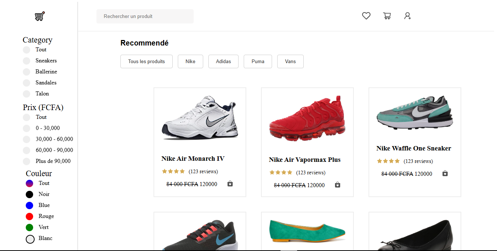

<div align="center">

<h1 style="font-size: 6rem; font-weight: 900; margin: 2rem 0; padding: 1rem; color: #0055ff; background: linear-gradient(135deg, #0070f3, #00c6ff); -webkit-background-clip: text; -webkit-text-fill-color: transparent; text-shadow: 4px 4px 8px rgba(0,0,0,0.2); letter-spacing: 2px; line-height: 1.1; transform: scale(1.05); display: inline-block;">🛍️ E-commerce Project</h1>

[](https://reactjs.org/)
[](https://developer.mozilla.org/en-US/docs/Web/JavaScript)
[](https://www.w3.org/Style/CSS/)
[](https://nodejs.org/)

A modern and responsive e-commerce platform built with React, featuring dynamic product filtering, intuitive navigation, and a seamless shopping experience.

[View Demo](#) · [Report Bug](../../issues) · [Request Feature](../../issues)

</div>

## 🌟 Features

- 🔍 Advanced product filtering and search
- 📱 Responsive design for all devices
- 🎨 Dynamic color and category filters
- 💰 Price range filtering
- 🛒 Intuitive shopping interface
- 🎯 Product recommendations

## 🚀 Demo

<div align="center">

[]()



</div>


## 🛠️ Tech Stack

- **Frontend Framework:** React.js
- **Styling:** CSS3 with custom styling
- **State Management:** React Hooks
- **Package Manager:** npm
- **Development Environment:** Node.js

## 🚀 Getting Started

### Prerequisites

- Node.js (v14.0.0 or higher)
- npm (v6.0.0 or higher)

```bash
node -v
npm -v
```

### Installation

1. Clone the repository
```bash
git clone https://github.com/yourusername/ecommerce-project.git
```

2. Navigate to project directory
```bash
cd ecommerce-project
```

3. Install dependencies
```bash
npm install
```

4. Start the development server
```bash
npm start
```

## 🎮 Usage

The application will be available at `http://localhost:3000`. You can:

- Browse products by category
- Filter items by color
- Set price ranges
- Search for specific products
- View recommended items

## 📦 Project Structure

```
ecommerce-project/
├── public/
├── src/
│   ├── Navigation/     # Navigation components
│   ├── Products/       # Product listing components
│   ├── Recommended/    # Product recommendations
│   ├── Sidebar/        # Filtering sidebar
│   ├── components/     # Reusable components
│   └── db/            # Mock database
```

## 🌐 Deployment

This project can be deployed using various platforms:

- [Vercel](https://vercel.com)
- [Netlify](https://netlify.com)
- [GitHub Pages](https://pages.github.com)

Follow the deployment guides of your preferred platform.

## 📄 License

Distributed under the MIT License. See `LICENSE` for more information.

---

<div align="center">

Made with ❤️ by [Prince Nafis TOURE]

</div>
